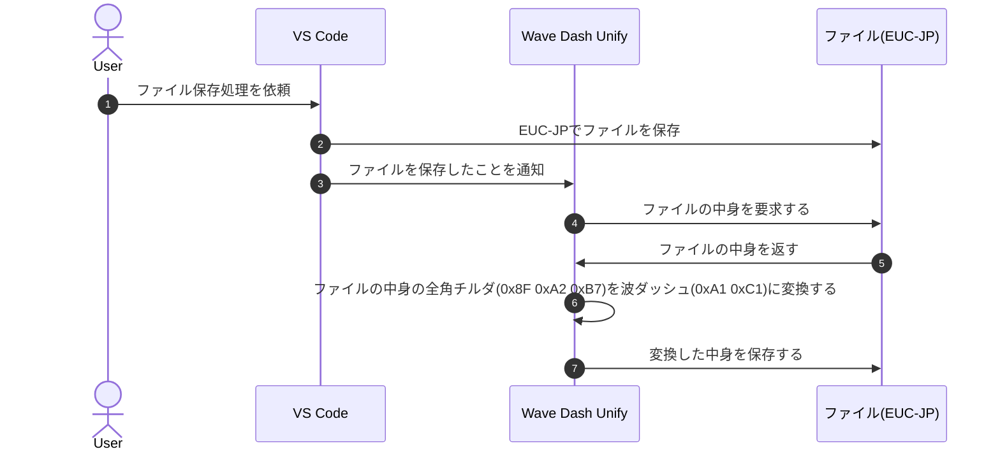
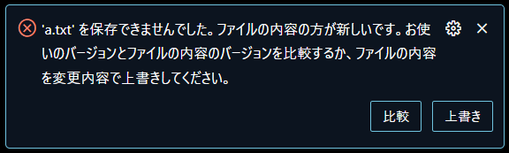

# Wave Dash Unify

EUC-JP のファイルを保存した時に、全角チルダ(0x8F 0xA2 0xB7)を波ダッシュ(0xA1 0xC1)に変更します

## Features

VS Code ではファイルの文字コードに EUC-JP を指定した状態で`～`という文字を保存した際に一般的に使われる波ダッシュ(0xA1 0xC1)ではなく、全角チルダ(0x8F 0xA2 0xB7)で保存されます

そのため、VS Code で`～`を含まれる EUC-JP のファイルを編集した際に他のツールでファイルを閲覧すると文字化けするといった問題が発生します

この拡張機能をインストールすると、EUC-JP のファイルを保存した時に全角チルダ(0x8F 0xA2 0xB7)を波ダッシュ(0xA1 0xC1)に変更し、前述の文字化け問題を回避します

おおまかな処理は以下の通りです

## Extension Settings

- `waveDashUnify.enable`: Enable Wave Dash Unify

## Known Issues

### [Ctrl+S を長押しすると、ファイルの上書きに失敗する](https://github.com/yutotnh/wave-dash-unify/issues/13)

`Ctrl+S`を長押しするなどして、短時間に連続して`～`の含まれる EUC-JP のファイルを保存した場合に、下記画像のようなエラーが発生します

## Release Notes

See changelog
