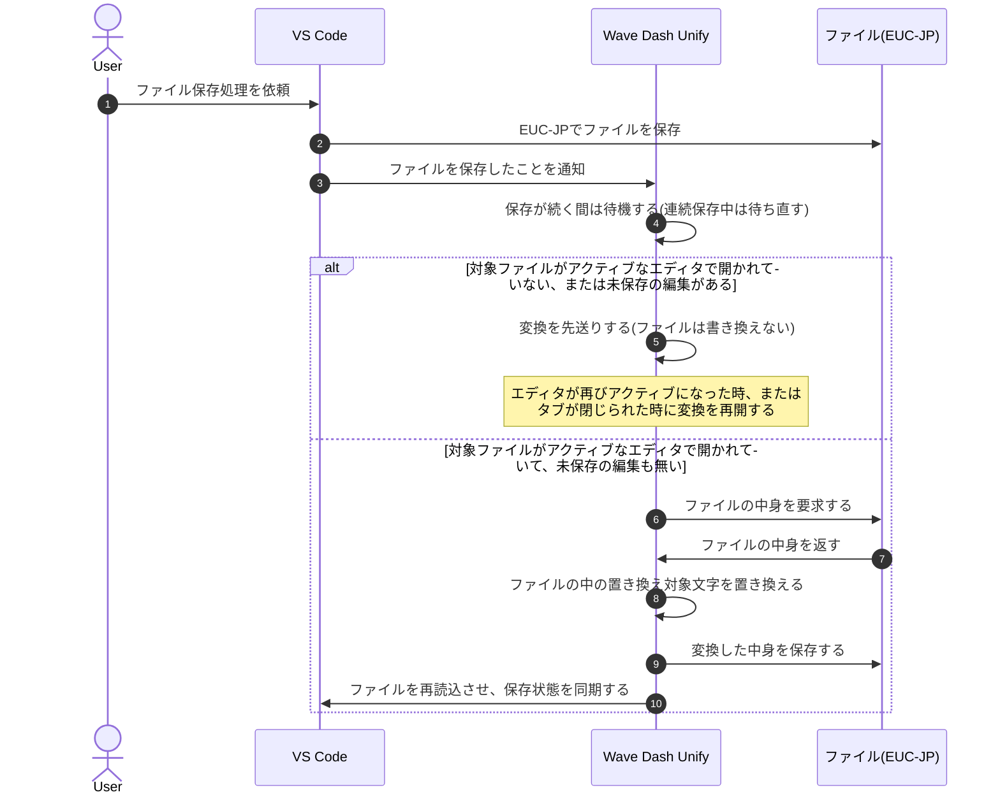

# Wave Dash Unify

EUC-JP のファイルを保存した時に、以下の文字の置き換えを行います。

| 置き換え対象文字                | 置き換え後                 |
| ------------------------------- | -------------------------- |
| 全角チルダ (～: 0x8F 0xA2 0xB7) | 波ダッシュ (〜: 0xA1 0xC1) |
| 全角NO (№: 0x8F 0xA2 0xF1)      | 全角NO (№: 0xAD 0xE2)      |

## Features

VS Code ではファイルの文字コードに EUC-JP を指定した状態で`～`という文字を保存した際に一般的に使われる波ダッシュ(0xA1 0xC1)ではなく、全角チルダ(0x8F 0xA2 0xB7)で保存されます

そのため、VS Code で`～`を含まれる EUC-JP のファイルを編集した際に他のツールでファイルを閲覧すると文字化けするといった問題が発生します

この拡張機能をインストールすると、EUC-JP のファイルを保存した時に全角チルダ(0x8F 0xA2 0xB7)を波ダッシュ(0xA1 0xC1)に変更し、前述の文字化け問題を回避します

その他置き換え対象文字についても、同様の処理を行います

おおまかな処理は以下の通りです

```mermaid
sequenceDiagram
    autonumber

    actor User
    participant vscode as VS Code
    participant extension as Wave Dash Unify
    participant file as ファイル(EUC-JP)

    User ->> vscode: ファイル保存処理を依頼
    vscode ->> file: EUC-JPでファイルを保存
    vscode ->> extension: ファイルを保存したことを通知
    extension ->> extension: 保存が続く間は待機する(連続保存中は待ち直す)

    alt 対象ファイルがアクティブなエディタで開かれていない、または未保存の編集がある
        extension ->> extension: 変換を先送りする(ファイルは書き換えない)
        note over extension: エディタが再びアクティブになった時、または<br/>タブが閉じられた時に変換を再開する
    else 対象ファイルがアクティブなエディタで開かれていて、未保存の編集も無い
        extension ->> file: ファイルの中身を要求する
        file ->> extension: ファイルの中身を返す
        extension ->> extension: ファイルの中の置き換え対象文字を置き換える
        extension ->> file: 変換した中身を保存する
        extension ->> vscode: ファイルを再読込させ、保存状態を同期する
    end
```

連続して保存された場合に待機するのは、保存の直後にファイルを書き換えると VS Code の保存処理と競合してしまうためです

同じ理由で、変換後のファイル状態を VS Code に同期する手段(再読込)はアクティブなエディタにしか効きません。そのため対象ファイルがアクティブなエディタで開かれていない間は変換そのものを行わず、再びアクティブになったタイミングやタブが閉じられたタイミングまで待ちます。この間、ファイルはディスク上では未変換(全角チルダなどを含む正当な EUC-JP ファイル)のままです

## Requirements

VS Code 1.66.0 以降で動作します

VS Code 1.100.0 以降では、VS Code 自身が持つエンコーディング情報(`TextDocument.encoding` API)を使って EUC-JP を判定します。この API があれば、ユーザーが「エンコーディング付きで再度開く」で明示的に指定した内容もそのまま反映されます

1.100.0 より前のバージョンにはこの API が無いため、ファイルのバイト列から EUC-JP かどうかを推定します。この推定には次の限界があります

- EUC-JP と同じバイト構造を持つ他のマルチバイトエンコーディング(GBK など)のファイルを、EUC-JP と誤判定する可能性がわずかにあります
- ユーザーが VS Code 上で指定したエンコーディングは判定に反映されません
- 保存時に、エンコーディングを問わず一度ファイル全体を走査するため、大きなファイルでは 1.100.0 以降より保存後の処理が重くなります

いずれも 0.3 系までと同じ挙動です。1.100.0 以降ではこの推定を行いません

## Extension Settings

- `waveDashUnify.enableConvert`: 文字の変換をします
- `waveDashUnify.fullwidthTildeToWaveDash`: 全角チルダ (0x8F 0xA2 0xB7) を波ダッシュ (0xA1 0xC1) に変換します
- `waveDashUnify.numeroSignToNumeroSign`: 全角NO (0x8F 0xA2 0xF1) を全角NO (0xAD 0xE2) に変換します
- `waveDashUnify.statusBarFormat`: ステータス バーのフォーマット

## Release Notes

See changelog
